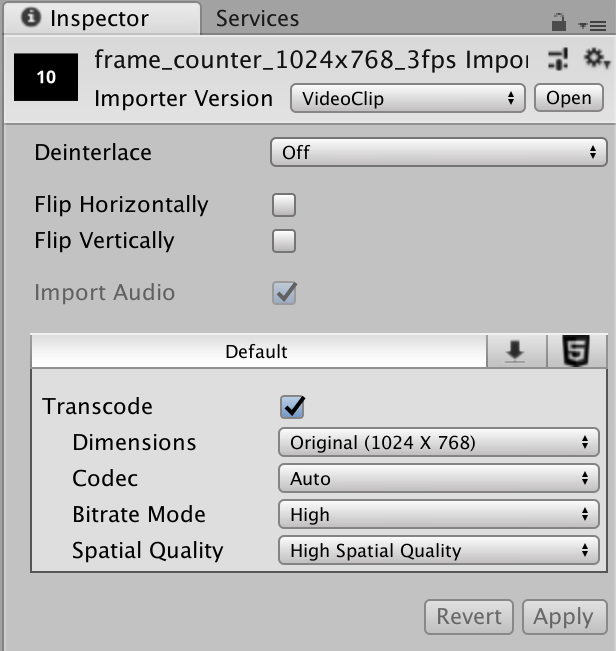

# Timeline Manager

**Unity version:** `2018.2.19f1`  
**Branch:** `feature/timeline-manager`  

[Overview](#overview)  
[+-- TimelineManager](#timelinemanager)  
[|&nbsp;&nbsp;&nbsp; +-- PlayableDirector](#playabledirector)  
[|&nbsp;&nbsp;&nbsp; +-- VideoPlayer](#videoplayer)  
[|&nbsp;&nbsp;&nbsp; +-- VideoController](#videocontroller)  
[|&nbsp;&nbsp;&nbsp; +-- TimelineController](#timelinecontroller)  
[|&nbsp;&nbsp;&nbsp; +-- InputController](#inputcontroller)  
[+-- Prepare Video](#prepare-video)  
[|&nbsp;&nbsp;&nbsp; +-- Transcoding Video](#transcoding-video)  
[+-- Classes](#classes)  

[](https://youtu.be/1JF08DgxJKo)
## Overview

The point of this branch is to show an example of an FBX animation clip being
synced to a Video playing in the camera's projection plane.
The video footage runs at 3 FPS and simulates security cam footage being used
for **matchimation** purposes.

It also gives an example of using the TimelineAsset with multiple animation
clips.  These Timelines can be Instantiated at Runtime, blended to create new
motions or slowed down to create *bullet-time* effects.

> If you don't need synced video, the **InputController** could swap out the 
calls to the **VideoController** for the **TimelineController** to just play 
animation.

## TimelineManager

The TimelineManager is made up of 5 components:
1. PlayableDirector
1. VideoPlayer
1. VideoController
1. TimelineController
1. InputController


### PlayableDirector
This holds a `TimelineAsset`, which is a _Track_ that holds as many animation
clips as you want. It can be treated as a non-linear editor, stringing clips
together.  A `PlayableDirector` can control other `PlayableDirectors` for
building animated `PlayableGraphs` into complex sequences, a.k.a. _cutscenes_,
with camera edits, particle fx, lighting changes, etc.

### VideoPlayer
Simply put, this plays the video and creates our Overlay.

### VideoController
This class implements Play/Pause and Seek controls on the Video element.

### TimelineController
Same as `VideoController`, except for Timelines with Animation clips.

### InputController
```
Spacebar: Play/Pause
Left Arrow: Go to previous frame
Right Arrow: Go to next frame
Equals Key (=): Alpha up
Minus Key (-): Alpha down
```
> I used Equals and Minus because they _look_ like '+' and '-' on the 
keyboard without having to hold `Shift`

## Prepare Video
In order to implement **Seek** functionality video files must be created with
specific compression settings in the original authoring package.
The default settings for H.264 were causing a 
[known issue]("https://forum.unity.com/threads/5-6-0b1-videoplayer-api-go-to-specific-frame.446507/#post-2888381")
on Windows which would not allow the player to step through a video frame by frame.

**Compression** - `H.264`  
**Quality** - `75%`  
**Frame Rate** - `30` (or whatever)  
**Key Frames** - `30` (Lower means fewer image artifacts, bigger files)  
**Primaries** - `SMPTE_RP_431_2011`  
**Transfer** - `SMPTE_240M`  
**Matrix** - `SMPTE_240M`  
**Pixel AR** - `1920x1080 HDTV or 1280x720 HDTV`  

### Transcoding Video
Open the file in Unity, highlight in the Inspector and let Unity transcode 
it.
> This fixed an issue with the frame always being 1 less than expected on
Mac and Windows.



## Classes
Here I am going to highlight the noteworthy functions.

### VideoController
#### Methods

**FrameReady** (callback/listener)

First you need to enable this event trigger somewhere in your code with a line like:  
`_videoPlayer.sendFrameReadyEvents = true;`  
This event fires every time the next video frame has loaded. Here we are using
the callback to pause playback if we hit the last frame (this frame range is
set in the Editor).

```c#
private void FrameReady(VideoPlayer player, long frameIndex)
{
    frameReady = true;
    _currentFrame = (int)frameIndex;
    // Check if the last frame of the range has loaded
    if (_currentFrame == outFrame)
    {
        Pause();
    }
}
```

**AdjustAlpha**

Adjusts the alpha value of the video projection in the camera's near/far plane.

```c#
public void AdjustAlpha(float value)
{
    var newAlpha = Mathf.Clamp(value + _videoPlayer.targetCameraAlpha, 0, 1);
    _videoPlayer.targetCameraAlpha = newAlpha;
}
````

### TimelineController
#### Methods

**FrameReady** (callback/listener)

This is the crux of getting the animation clips to sync with the video.  
As soon as the `VideoPlayer` renders a new frame, the animation timeline is
advanced.

```c#
private void FrameReady(VideoPlayer player, long frameIndex)
{
    GoToFrame((int)frameIndex);
}
```

# Final Thoughts
While this is working for a 3 FPS video clip and animation, I have doubts
about whether it will play smoothly at higher frame rates.  The `FrameReady`
event that the `VideoPlayer` emits is supposedly a **very** expensive method
to employ, however, it was a readymade way to isolate the components and
control the animation.
